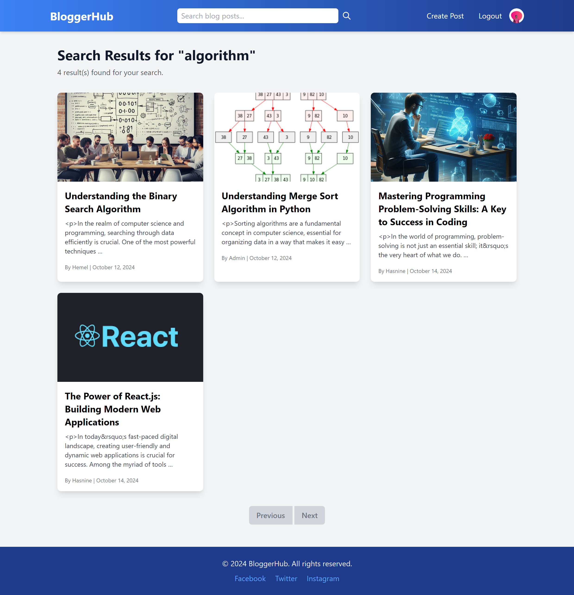
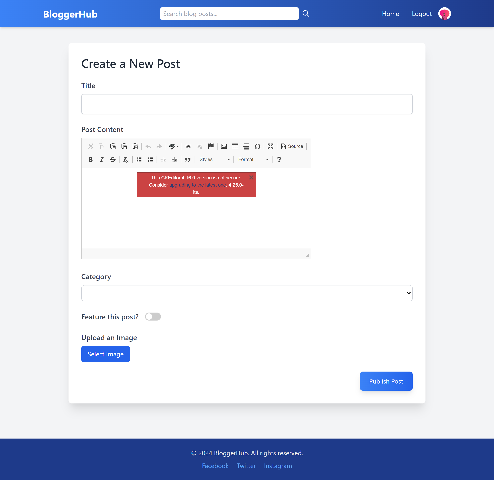
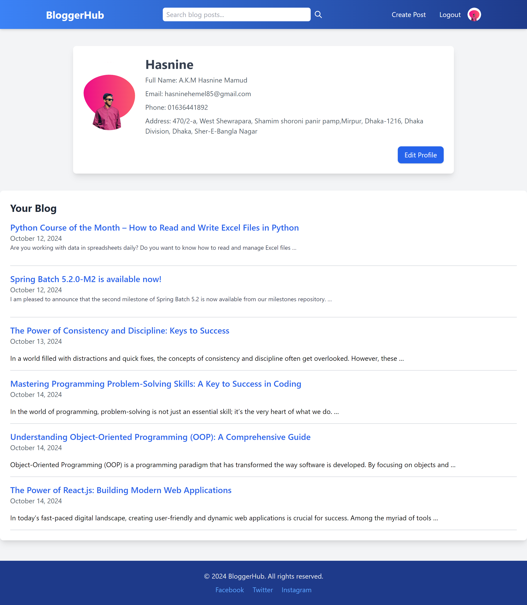
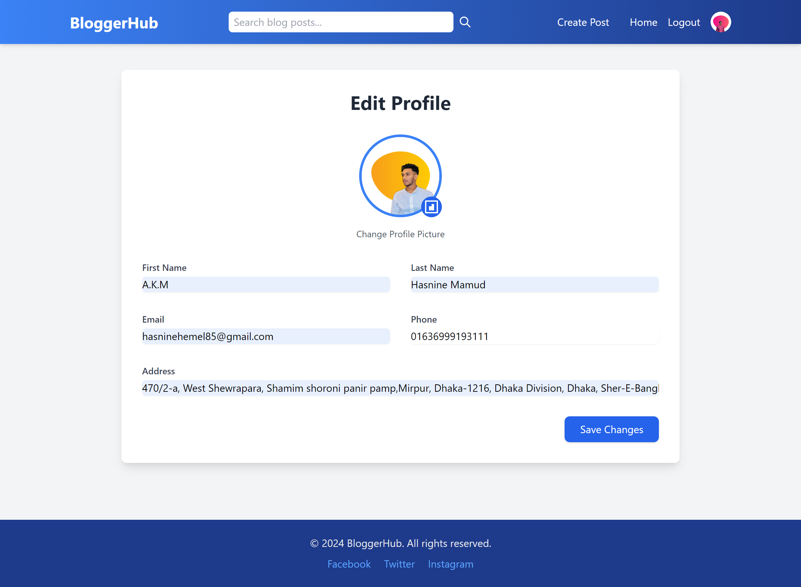
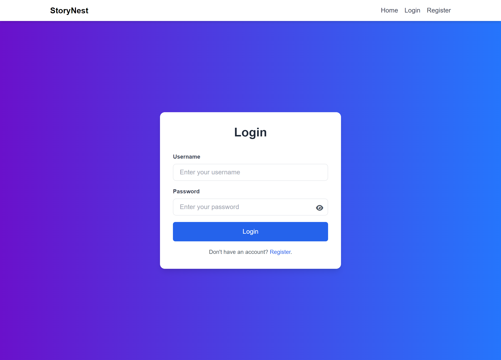
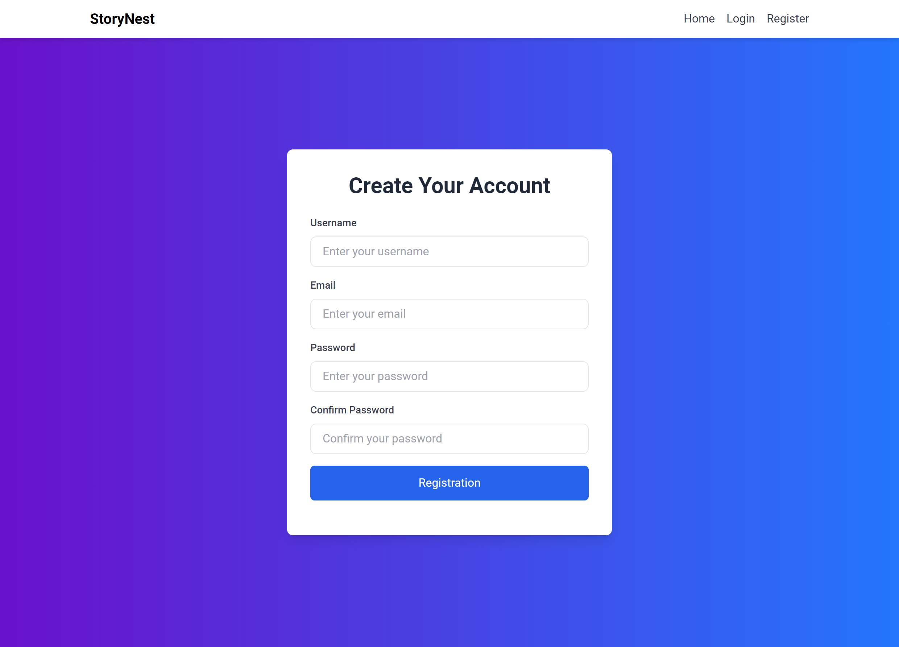

# Django Blogging Platform

## Overview
BloggerHub is a fully functional blogging platform built with Django, a high-level Python web framework. The platform allows users to create, read, update, and delete blog posts while supporting user registration, authentication, and a rich text editor for content creation.

## Key Features

### User Authentication
- Users can register, log in, and log out.
- Password management is facilitated with Django's built-in authentication system.

### Blog Management
- Users can create new blog posts, which include a title, content, category, and optional image.
- Posts can be edited or deleted by the author.
- Admin functionality is available for managing posts and categories.

### Rich Text Editing
- Utilizes **CKEditor** for a user-friendly content creation experience, allowing authors to format text, insert images, and create links easily.

### Categorization
- Blog posts can be categorized for better organization and easier navigation.
- Users can view all posts within a specific category.

### Search Functionality
- A search feature enables users to find posts by title or content keywords.

### Pagination
- Blog post listings are paginated to improve performance and user experience, displaying a limited number of posts per page.

### Responsive Design
- The platform is designed to be mobile-friendly, ensuring a seamless experience across various devices.

## Technologies Used
- **Backend:** Django (Python)
- **Frontend:** HTML, TailwindCSS, JS for responsive design
- **Database:** SQLite 
- **Rich Text Editor:** CKEditor
- 
### Admin Credentials 
username - admin, password - admin

## Installation
To set up the project locally:

1. Clone the repository from GitHub.
   ```bash
   git clone [(https://github.com/Hasninemamud/BloggerHub)]
2. Install the required packages:
   ```bash
   pip install -r requirements.txt
3. Apply migrations:
   ```bash
   python manage.py migrate
4. Create a superuser to access the admin panel:
   ```bash
   python manage.py createsuperuser
5. Run the development server:
   ```bash
   python manage.py runserver

## Contributing

We welcome contributions! To contribute to this project, please follow these steps:

1. **Fork the repository**:
   Click the "Fork" button at the top right of the repository page to create a personal copy of the project.

2. **Create a new branch**:
   Use the following command to create a new branch for your feature or fix:
   ```bash
   git checkout -b feature/YourFeature
3. **Commit your changes**
   ```bash
   git commit -m 'Add new feature'
4. **Push to the branch**
   ```bash
   git push origin feature/YourFeature
   
## Future Enhancements

### 1. User Roles and Permissions
- **Objective:** Implement a role-based access control system to manage user permissions effectively.
- **Details:** Introduce user roles such as **Admin**, **Editor**, and **Reader**. Admins can manage all posts and users, Editors can create and edit posts, while Readers can only view content. This will help in maintaining a structured workflow and improve security.

### 2. Commenting System
- **Objective:** Enable users to interact with blog posts through comments.
- **Details:** Implement a commenting feature that allows users to leave feedback or questions on blog posts. This can foster community engagement and discussions among readers.

### 3. Social Media Sharing
- **Objective:** Allow users to share blog posts on social media platforms.
- **Details:** Integrate social media sharing buttons (e.g., Facebook, Twitter, LinkedIn) on each post to facilitate easy sharing. This will help increase the visibility of posts and attract a wider audience.

### 4. Enhanced Search Functionality
- **Objective:** Improve the search feature for better user experience.
- **Details:** Add filters for search results based on categories, tags, and date ranges. Implementing tags will also allow users to browse related content easily, making navigation through the blog more intuitive.

## BloggerHub Visuals
Here are some images showcasing the features of the project:










